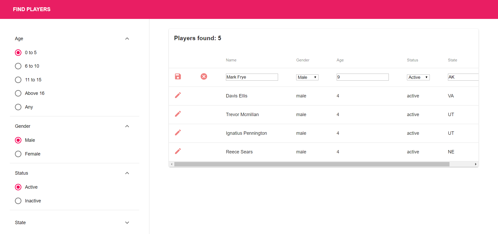

# Filtering

Filtering web app interface that using data fetched from https://dii-test.s3.amazonaws.com/players.json

When more than one filter is applied, the “AND” operator applies to all filters. For example, an age filter of 15-17 and a location filter of VA should only show players that are aged 15, 16, or 17 and are from VA. All filters are case insensitive. Data persistence is not required when editing user information.

The output should show all the players that fit within the specific criteria along with the number of players that fit the criteria.

### Completed:

1. To filter a list of players based on specific criteria. These are the search filters you will be creating based on the test data:
   - Age: allow the user to filter for players within a specific age or age range (e.g. 7, 5-9, 15-17, etc.)
   - Gender: allow the user to filter for players based on their specified gender
   - State: allow the user to filter for players based on the state they reside in from available test data
   - Status: allow the user to filter for players based on their status (active/inactive)

You can apply more than one filter to narrow down your search results.

2. To edit the information of any player.

### Screenshot:

### In progress & future:

The cart needs to fetch all info from authenticated user's cart
Users are able to purchase items and show up in history puschase
The users are able to see his/her own info and edit if possible.
The list view should look a little more organized.
The site needs to be responsive and more cohesive.

## Getting Started

React installed
Nodemon installed

## Technologies & Tools

- HTML/CSS
- Material-UI
- React

## Prerequisites

Understanding of ReactJS, Javascript

### Installing

1. Clone the repo to your local machine \
   `$ git clone https://github.com/ngthu1995/filtering`

2. Install dependencies on server: \
   `$ npm install`

3. Start server: \
   `$ npm start`

4. App now running on

## Built With

ReactJS

## Author

Thu Nguyen - personal website: http://thunguyen.space/

## License

This project is licensed under ThuNguyen@2019.
